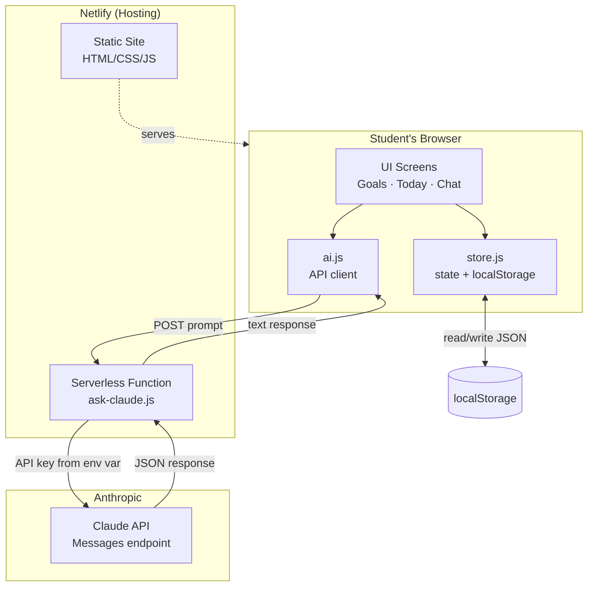
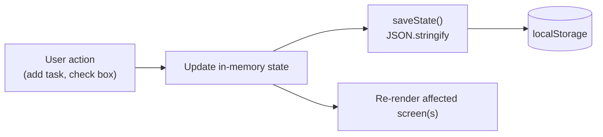
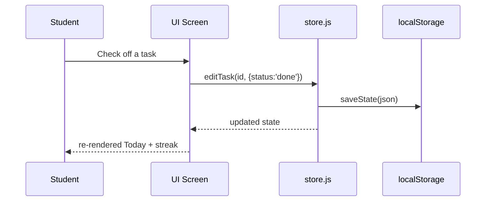
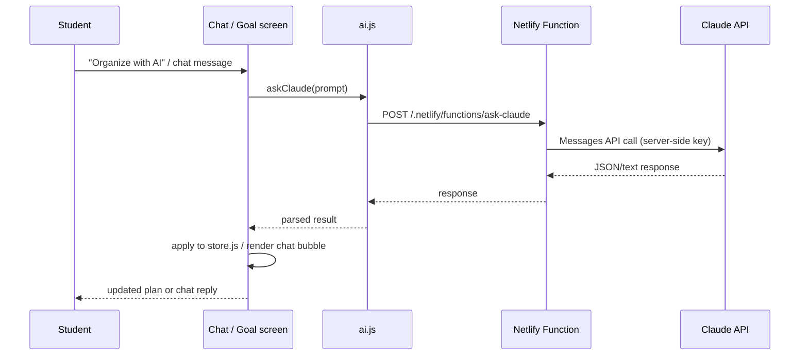

# StudyPilot AI — Architecture

Day 2 deliverable. Source of truth for how the pieces fit together. No backend/database server — a static front-end plus one serverless function.

## 1. Component Diagram

**Why this shape:** the entire app is a static site — no server to run or maintain. The one exception is the serverless function, which exists solely to keep the Claude API key out of client-side code (a key embedded in browser JS is publicly visible to anyone). Everything else (Goals, Tasks, Today, Progress) works with zero network calls at all.

## 2. Data Flow

Every mutation follows this same one-directional loop: **action → state update → persist → re-render.** No screen keeps its own separate copy of data — `store.js` is the single source of truth, read by `goals.js`, `today.js`, `progress.js`, and `chat.js` alike.

## 3. Request Lifecycle — Standard (non-AI) Action

Fully synchronous, no network — this is why the app stays fast and works even if AI/network is unavailable (PRD resilience requirement).

## 4. Request Lifecycle — AI-Powered Action

The Netlify Function is stateless — it doesn't know about goals/tasks. All context (current tasks, streak, etc.) is assembled client-side into the prompt before it's sent.

## 5. AI Interaction Detail

Two distinct AI flows exist, both routed through the same `askClaude()` helper:

| Flow | Trigger | Prompt contains | Expected response |
|---|---|---|---|
| **Plan Customization** | "Organize with AI" button on a goal | Goal title + raw task titles | Strict JSON: `{ "schedule": [{taskId, scheduledDate}] }` |
| **Chat Guidance** | Message sent in Chat screen | User message + summary of today's tasks, active goals, current streak | Plain text, 2-4 sentences |

Both are additive — if the Claude API is unreachable, Goals/Tasks/Today/Progress continue to work using existing data (per PRD's Resilience non-functional requirement).

## 6. External Services

| Service | Purpose | Free tier limits to be aware of |
|---|---|---|
| **Netlify** | Static hosting + serverless function + GitHub auto-deploy | Free tier: 100GB bandwidth/mo, 125k function invocations/mo — far beyond a personal-scale project |
| **Anthropic Claude API** | Plan customization + chat guidance | Usage-based; monitor usage in the Anthropic console |
| **Google Fonts CDN** | Inter, Space Grotesk, JetBrains Mono | Free, no limits for this scale |

## 7. Why No Traditional Backend/Database

This is a deliberate architectural decision carried over from the PRD (5.1, 9): a backend + database would require hosting, authentication, and data-migration concerns — none of which fit a 9-day, 1.5–2 hr/day build. `localStorage` fully satisfies the v1.0 requirement of single-device persistence. Cloud sync is explicitly deferred (PRD 5.2, 11).
