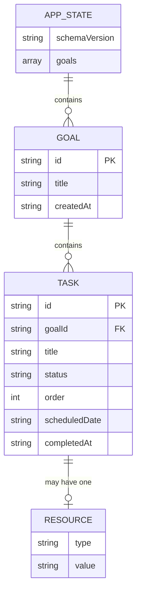

# StudyPilot AI — Data Schema

There is no database server — this document specifies the shape of the single JSON object persisted in browser `localStorage` under the key `studypilot_v1`.

## 1. Entity-Relationship Diagram

## 2. Collections / Objects

### `AppState` (root object)
| Field | Type | Constraints | Notes |
|---|---|---|---|
| `schemaVersion` | string | required, e.g. `"1"` | Allows safe future migrations without breaking old saved data |
| `goals` | array of `Goal` | required, default `[]` | |

### `Goal`
| Field | Type | Constraints | Notes |
|---|---|---|---|
| `id` | string | required, unique, `crypto.randomUUID()` | Primary key |
| `title` | string | required, 1–80 chars | e.g. "Python + DSA" |
| `createdAt` | string (ISO date) | required | Set once, never modified |
| `tasks` | array of `Task` | required, default `[]` | |

### `Task`
| Field | Type | Constraints | Notes |
|---|---|---|---|
| `id` | string | required, unique, `crypto.randomUUID()` | Primary key |
| `goalId` | string | required | Foreign key — must match a `Goal.id` (implicit; tasks are nested under their goal in storage, so this is really positional, but kept explicit for clarity/future migration to a flat structure) |
| `title` | string | required, 1–140 chars | |
| `status` | enum | `"todo"` \| `"done"`, default `"todo"` | |
| `order` | integer | required, ≥0 | Manual ordering within a goal |
| `scheduledDate` | string (YYYY-MM-DD) \| `null` | optional | Set by AI Plan Customization (Day 7); `null` = unscheduled/any-day |
| `resource` | `Resource` \| `null` | optional | See below |
| `completedAt` | string (ISO datetime) \| `null` | set automatically when `status` → `"done"`; cleared if unchecked | Drives streak/heatmap calculations |

### `Resource` (embedded, not a separate collection)
| Field | Type | Constraints | Notes |
|---|---|---|---|
| `type` | enum | `"link"` \| `"note"` | |
| `value` | string | required, 1–500 chars | URL if `type: "link"`, free text if `type: "note"` |

## 3. Constraints & Validation Rules

- A `Goal` must have at least a `title`; it may exist with zero tasks.
- A `Task.title` cannot be empty — enforced client-side before `addTask()`/`editTask()` commits.
- `Task.resource` is capped at **one per task** (PRD F7 — intentionally not an array, to keep scope light).
- `Task.status` transitions only between `"todo"` and `"done"` — no third state in v1.0.
- `completedAt` must always be `null` when `status` is `"todo"`, and a valid ISO datetime when `status` is `"done"` — kept in sync by the same `editTask()` function, never set independently, to avoid drift.
- `scheduledDate`, if present, must be a valid `YYYY-MM-DD` string — validated before AI-returned schedules are applied (Day 7 defensive parsing).
- Deleting a `Goal` cascades — all its `Task` objects are removed with it (no orphaned tasks, since tasks are nested, not referenced).

## 4. Validation Against User Stories (PRD Section 8)

| User story | Schema support |
|---|---|
| Create a goal and list my own tasks | `Goal.title` + `Goal.tasks[]`, populated via `addTask()` |
| Have AI sequence my tasks into a daily plan | `Task.scheduledDate`, written by the Day 7 AI flow |
| Open the app and see what to do today | `Task.scheduledDate` + `Task.status` queried by `getTodayTasks()` |
| Ask the assistant what to study when unsure | Chat reads `goals[].tasks[]` + `getTodayTasks()` to build context — no new fields needed |
| Check off completed tasks | `Task.status` + `Task.completedAt` |
| See my streak and heatmap | `Task.completedAt` aggregated by `getCompletionsByDate()` / `getCurrentStreak()` |
| Attach a link or note to a task | `Task.resource` |

Every user story is covered by an existing field — **no schema gaps found.**

## 5. Storage Mechanics

- **Key:** `localStorage['studypilot_v1']`
- **Format:** single `JSON.stringify`-ed object matching `AppState` above
- **Read:** `loadState()` — wrapped in try/catch; returns `{ schemaVersion: "1", goals: [] }` if missing or corrupt (never crashes the app)
- **Write:** `saveState(state)` — called after every mutating operation, no batching, no debounce needed at this data scale
- **Migration path:** `schemaVersion` field reserved for future format changes (e.g. moving to IndexedDB or a real backend post-v1.0) without needing to guess the shape of old data
