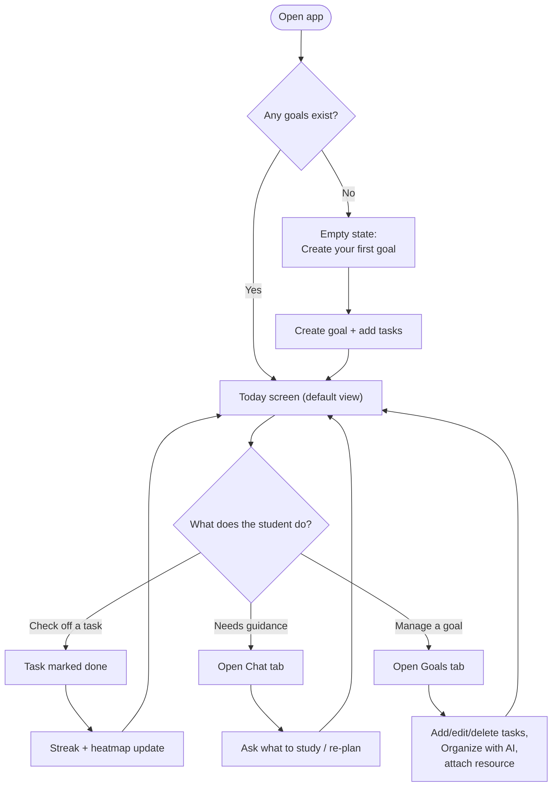
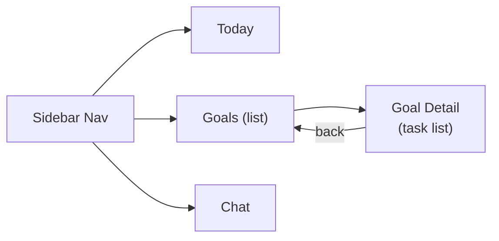

# StudyPilot AI — UI & User Flow

## 1. User Flow Diagram



The loop is intentionally small: **Today is home base**, and every other screen is a short detour that feeds back into it — this matches the PRD's "calm, single-focus" usability requirement.

## 2. Screen Flow (Navigation Map)



Only **3 top-level tabs** (Today, Goals, Chat) plus one drill-down (Goal Detail). No settings screen, no onboarding wizard, no account screens — consistent with the approved out-of-scope list.

## 3. Screen-by-Screen Purpose (every screen justified)

| Screen | Why it exists | Primary user story served |
|---|---|---|
| **Today** | Removes daily decision fatigue; the app's hero feature | "Open the app and immediately see what to do today" |
| **Goals (list)** | Overview of all active learning tracks | "Create a goal and list my own tasks" |
| **Goal Detail** | Where tasks are added/edited/organized/resourced | "Have AI sequence my tasks", "attach a link or note" |
| **Chat** | On-demand guidance beyond the proactive Today view | "Ask the assistant what to study when unsure" |

No screen exists without a direct PRD user story behind it.

## 4. Low-Fidelity Wireframes

### 4.1 Today Screen (default/landing view)
```
┌─────────────────────────────────────────────────┐
│ [Today] [Goals] [Chat]              StudyPilot AI│
├─────────────────────────────────────────────────┤
│  Wednesday, July 22          🔥 4-day streak      │
│                                                    │
│  ┌───────────────────────────────────────────┐  │
│  │ ☐  Python + DSA                            │  │
│  │    Arrays & Strings basics       [🔗]      │  │
│  ├───────────────────────────────────────────┤  │
│  │ ☐  Subject: DBMS                           │  │
│  │    Normalization forms                     │  │
│  ├───────────────────────────────────────────┤  │
│  │ ☑  Python + DSA                            │  │
│  │    Variables & data types (done)           │  │
│  └───────────────────────────────────────────┘  │
│                                                    │
│  [ Refresh priorities ]                           │
│                                                    │
│  ── Progress ──────────────────────────────────  │
│  [ heatmap: 13 weeks × 7 days grid, teal shades ] │
└─────────────────────────────────────────────────┘
```

### 4.2 Goals List
```
┌─────────────────────────────────────────────────┐
│ [Today] [Goals] [Chat]              StudyPilot AI│
├─────────────────────────────────────────────────┤
│  Your Goals                      [+ New Goal]     │
│                                                    │
│  ┌───────────────────────────┐ ┌────────────────┐│
│  │ Python + DSA               │ │ Subject: DBMS  ││
│  │ 6/10 tasks done             │ │ 2/8 tasks done ││
│  │ ▓▓▓▓▓▓░░░░ 60%              │ │ ▓▓░░░░░░ 25%   ││
│  └───────────────────────────┘ └────────────────┘│
└─────────────────────────────────────────────────┘
```

### 4.3 Goal Detail
```
┌─────────────────────────────────────────────────┐
│ ← Back to Goals        Python + DSA               │
├─────────────────────────────────────────────────┤
│  [ Organize with AI ]                             │
│                                                    │
│  + Add a task: [_______________________] [Add]   │
│                                                    │
│  ☐ Arrays & Strings basics      [🔗 note] [✎][🗑]│
│  ☐ Linked Lists                 [+ add resource] │
│  ☑ Variables & data types        [✎][🗑]         │
└─────────────────────────────────────────────────┘
```

### 4.4 Chat
```
┌─────────────────────────────────────────────────┐
│ [Today] [Goals] [Chat]              StudyPilot AI│
├─────────────────────────────────────────────────┤
│                                                    │
│   ┌──────────────────────────────┐               │
│   │ You: what should I study     │               │
│   │ today?                        │               │
│   └──────────────────────────────┘               │
│         ┌──────────────────────────────┐         │
│         │ AI: You've got "Arrays &     │         │
│         │ Strings" due today from      │         │
│         │ Python+DSA — that's a great  │         │
│         │ place to start.               │         │
│         └──────────────────────────────┘         │
│                                                    │
│  [ Type a message...                    ] [Send] │
└─────────────────────────────────────────────────┘
```

### 4.5 Empty States (all screens)
```
Today (no tasks):        "Nothing scheduled yet — add tasks to a goal to get started."  [Go to Goals]
Goals (no goals):        "You haven't created a goal yet."  [+ New Goal]
Goal Detail (no tasks):  "Add your first task above to get going."
Chat (first open):       "Ask me what to study today, or how to re-plan a goal."
```

## 5. Navigation Rules

- **Today is always the default tab** on app load (proactive-by-default, per PRD).
- Sidebar nav is persistent across all 3 top-level screens — no deep navigation stacks.
- Goal Detail is the only drill-down; a single "← Back to Goals" returns to the list — no breadcrumbs needed at this depth.
- No modal-heavy flows — inline forms (add goal, add task) expand in place rather than opening dialogs, keeping interactions lightweight.
